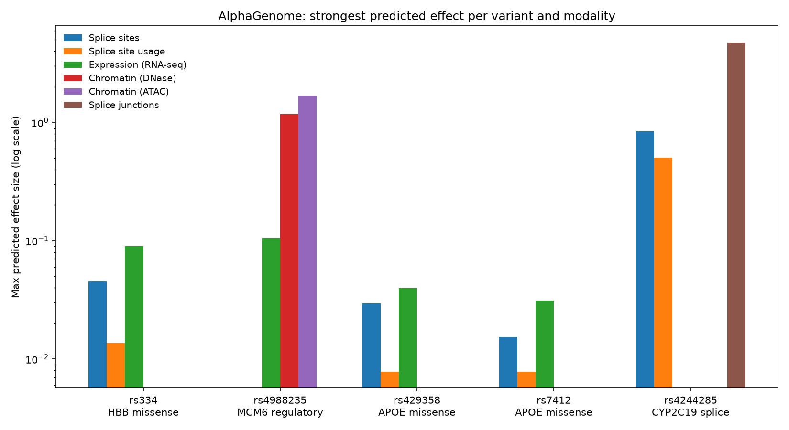

# Variant Effect Prediction with AlphaGenome

A demo of [AlphaGenome](https://deepmind.google/discover/blog/alphagenome-dna-to-rna/)
(Google DeepMind) applied to five well-known, publicly documented variants.
Each variant was chosen to exercise a different prediction modality:
splicing, expression, or chromatin accessibility. All coordinates are GRCh38,
verified against NCBI dbSNP. No private or personal data is used anywhere
in this repo.

## What AlphaGenome is

AlphaGenome is a deep learning model that predicts how a DNA variant changes
molecular readouts: splice site strength and usage, splice junction counts,
RNA expression, polyadenylation, and chromatin accessibility, across hundreds
of human cell types and tissues. Given a variant and a genomic window, it
returns predicted differences between the reference and alternate alleles.
This repo queries the hosted AlphaGenome API and summarizes the results.

## The variant panel

| Variant | Gene | Type | Why it was chosen |
|---|---|---|---|
| rs334 (chr11:5,227,002 T>A) | HBB | missense (Glu6Val) | The sickle-cell variant. A coding change with a huge phenotype, acting at the protein level. Expectation: quiet on splicing and expression. |
| rs4988235 (chr2:135,851,076 G>A) | MCM6 / LCT | intronic, regulatory | Lactase persistence. A noncoding enhancer variant that keeps LCT expressed into adulthood. Expectation: strong chromatin signal. |
| rs429358 (chr19:44,908,684 T>C) | APOE | missense | Defines the APOE-e4 haplotype, the strongest common risk factor for late-onset Alzheimer disease. |
| rs7412 (chr19:44,908,822 C>T) | APOE | missense | Defines the protective APOE-e2 haplotype. A contrast to rs429358: two missense variants, one gene, opposite risk directions. |
| rs4244285 (chr10:94,781,859 G>A) | CYP2C19 | splice defect (*2 allele) | Creates an aberrant splice site that knocks out enzyme activity and alters drug metabolism. Expectation: strong splicing signal. |

## Results

Strongest predicted effect per variant and modality (log scale):



| Variant | Strongest splicing effect | Strongest expression effect | Strongest chromatin effect |
|---|---|---|---|
| rs334 (HBB) | 0.05 (splice sites) | 0.09 (RNA-seq) | not tested |
| rs4988235 (MCM6) | not tested | 0.10 (RNA-seq) | 1.69 (ATAC-seq) |
| rs429358 (APOE) | 0.03 (splice sites) | 0.04 (RNA-seq) | not tested |
| rs7412 (APOE) | 0.02 (splice sites) | 0.03 (RNA-seq) | not tested |
| rs4244285 (CYP2C19) | 4.75 (splice junctions) | not tested | not tested |

## Interpretation

The predictions line up with the known biology, which is the point of the
demo:

- **rs4244285** lights up the splicing scorers: a new acceptor site
  (score 0.84) with large predicted junction changes (log fold change 4.75,
  strongest in liver tracks), matching the established *2 splice-defect
  mechanism.
- **rs4988235** shows the strongest chromatin effects in the panel (ATAC
  log2 fold change up to 1.69, top tissues including small intestine),
  exactly what you expect from an enhancer variant. Expression effects are
  modest, consistent with a subtle regulatory tweak rather than a knockout.
- **rs334, rs429358, rs7412** are near-null across these modalities. That is
  the honest and correct answer: these are missense variants whose effects
  play out at the protein level, which splicing and expression scorers are
  not designed to capture. A null prediction here is informative, not a
  failure. It is also a useful reminder that no single modality tells the
  whole story.

## Reproduce

```bash
pip install -r requirements.txt
python score_variants.py    # queries the API, writes results/variant_scores.json
python make_figure.py       # rebuilds figures/effects_by_modality.png
```

`score_variants.py` needs an AlphaGenome API key. It reads the key from a
local credential store at runtime (see the top of the script); the key is
never hard-coded or committed. Raw per-track scores for every scorer live
in `results/variant_scores.json`.

## Files

- `score_variants.py`: variant panel, API queries, JSON summaries
- `make_figure.py`: rebuilds the summary figure
- `results/variant_scores.json`: full per-track scores
- `figures/effects_by_modality.png`: summary plot
